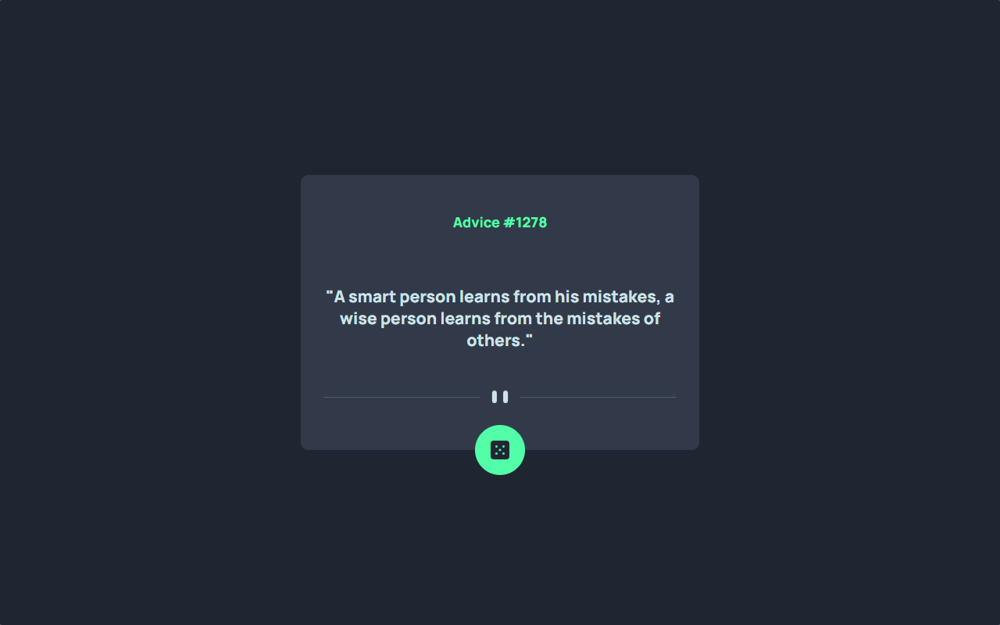
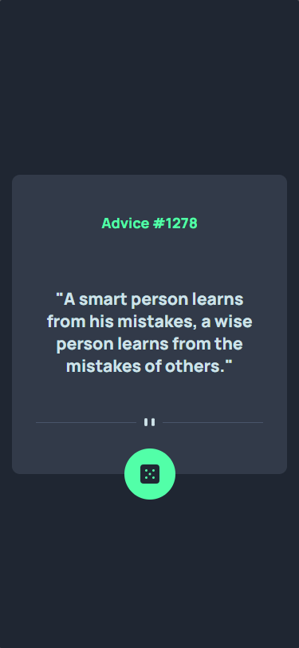

<h1 align="center"> Advice Gerator App </h1>

<h2 align="center">This project is a council generator made with HTML and CSS, initially it will be just the layout and with time interactive applications will be made with JavaScript.</h2>

 

Desktop image:

Mobile image:

---
## 💻**How was it done?**
This project is a challenge from [Frontend Mentor](https://www.frontendmentor.io/challenges/advice-generator-app-QdUG-13db), I was inspired by the layout and created the project using CSS FlexBox and CSS Grid techniques.

  

### 🎨 **Project Colors**:
- text-color: `hsl(193, 38%, 86%)`
- advice-dice-color: `hsl(150, 100%, 66%)`
- card-color: `hsl(217, 19%, 24%)`
- background-color: `hsl(218, 23%, 16%)`

  

### ⚡ Access the [project online](https://laisbagno.github.io/Advice-Gerator-App/)

---
### 💎 Follow me on [linkedin](https://www.linkedin.com/in/laisbagno/)